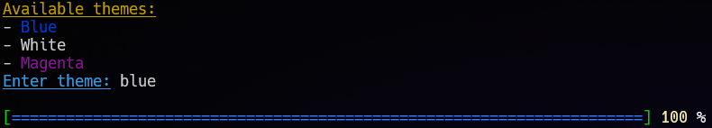
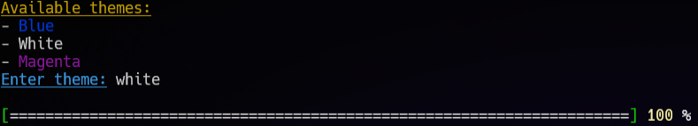
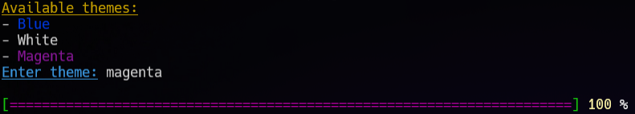

# cpp-progressbar

cpp-progressbar is a small console program I wrote in c++. 3 themes are available 

(this program only works on linux)

## Instalation

Download or fork the repo

```bash
$ git clone https://github.com/Zielin0/cpp-progressbar.git

$ cd cpp-progressbar
```

Make sure you have a **g++** compiler

To compile enter command

```bash
$ make
```

To run program enter command

```bash
$ ./progressbar
```

To clean use command

```bash
$ make clean
```

### Themes
You can choose one of three available themes

1. Blue



2. White



3. Magenta



## LICENSE

[MIT](./LICENSE)